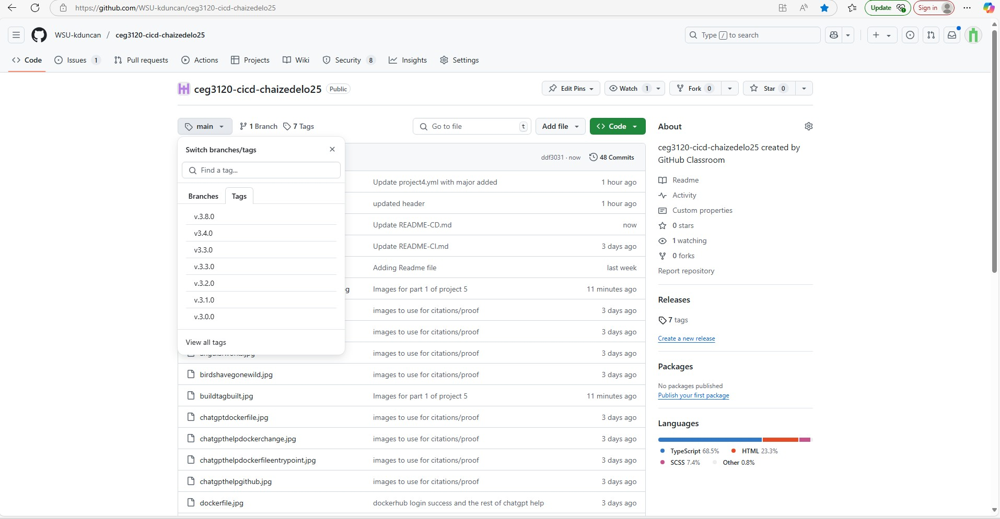
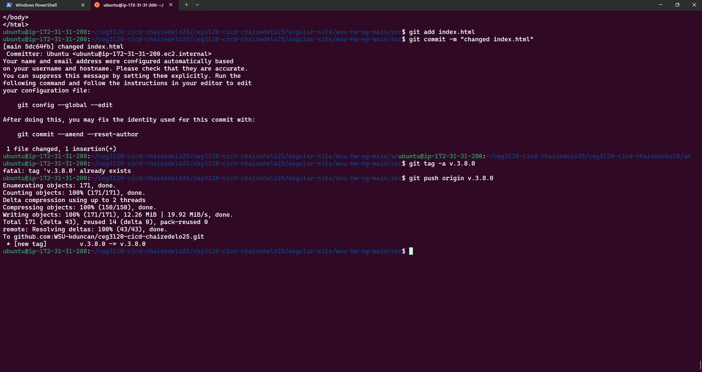
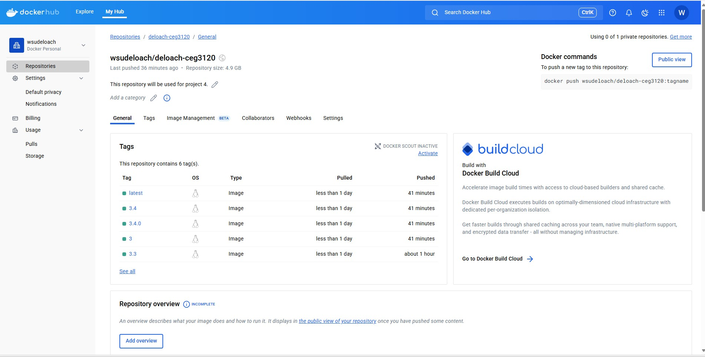
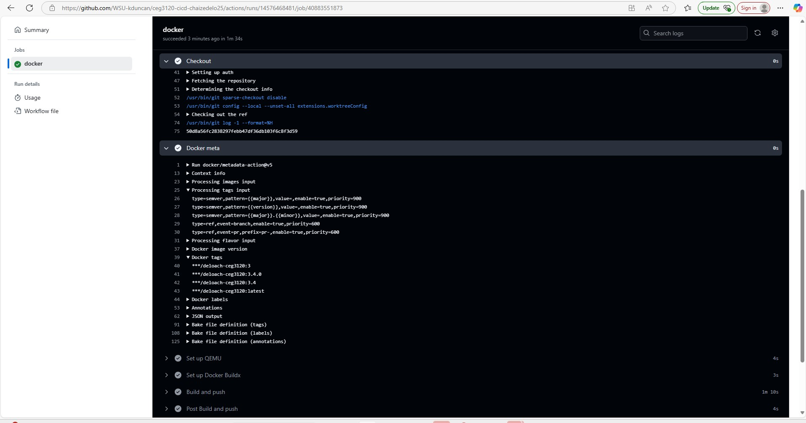

# Project 5 


## Part 1 - Semantic Versioning

## Generating Tags

  - To see tags in a github repo on the homepage in the github repo click on 
  main and then click on tags.

 - 

  - To generate a tag in a github repository, make sure the change is made to 
  the image file in this case index.html. Once that is changed run ```git add index.html ```.
  Then git commit -m "updating changes", but instead of running git push run ```git tag -a v.*.*.*```
  this will add the tag to make to the main branch. After that command run ```git push origin v.*.*.*```.
  This command will push the tag to the github repo.

  - 


## CI with GitHub Actions


  - In my workflow when a git tag is created and push the workflow begins to make a tag on the image container
  in my Dockerhub repository. It also has major and minor versions as specified in the workflow as well as a 
  latest tag as that comes built in. 

  - The steps of my workflow consits of:
  1. Logging into Dockerhub using github sercets did this first because the signing is important
  to make sure we can build and push to the dockerhub repo.

  2. Runs the checkout which clones the repository where the workflow is running.

  3. The docker meta step is next in my workflow which takes the tagged images created
  to my dockerhub repo. This step also sets up the semantic versioning with major, major.minor
  and the latest tags.

  4. The next step is the QEMU action step. QEMU stands for quick emulator, this step
  allows you to create can emulate different architectures, enabling you to build images for various platforms.
  Which is ideal because we need to be able to build the images.

  5. The next step is setting up the docker build which is important because this 
   is an extension of Docker that provides a powerful build environment.

  6. The final step is the docke build and push step which builds the image using the dockerfile created
  and pushes to the dockerhub repo identified in the docker meta step.

  
  - The changes from the previous workflow in Project 4 is that the docker meta step is added. As well in the 
  build and push step it's important to note that since my Dockerfile is in a sub-directory I had to add a context step
  that paths to my dockerfile. Also in this push build step we added in these instructions ``` tags: ${{ steps.meta.outputs.tags }}```
  and ``` labels: ${{ steps.meta.outputs.labels }}```. These instructions grab those tags and labels from the meta step to push to the
  the dockerhub repo.


  - Link to workflow: https://github.com/WSU-kduncan/ceg3120-cicd-chaizedelo25/blob/main/.github/workflows/project4.yml

  - To vaildate that the workflow did the tasking required is to go to the actions button in the github repo. This
  will show if the dockerhub action ran smoothly or not. It will also show the error in each instruction step on the workflow.
  
  - To vaildate the workflow worked on the dockerhub repo side log into the dockerhub repo and check the tag section, there will be 
  the pushed tags from the github workflow.

    
  - 

 
  - 


## Part 2 - Depolyment 


## Instance Details

  - The AMI used for this instance is the Ubuntu server 24.04 LTS.

  - The instance type is t2.medium.

  - The volume size is 30 GB.

  - The security group I chose are allowing the connection from Wright State's IP, my dorm room's IP, and my 
  home's IP address. I also added in the inbound rule of a connection on the ports 4200 and 9000. I made the 
  inbound rules for these ports because these ports are needed for our webhooks and the angular site.


## Docker Setup on OS on the EC2 instance 

 - These are the following steps that I took to download Docker on my AWS instance:

 1. ```sudo apt-get update``` (running this command first makes sure the instance is 
 up to date)

 2. ```sudo apt-get install docker.io -y``` (running this command installs docker on the instance)

 3. ```sudo systemctl start docker```(this command makes sure that docker is started on the instance and 
 is ready to use)

 4. ```sudo systemctl enable docker``` (this command makes sure that everytime the instance is started docker is 
 started)


## Testing on EC2 instance

  - To pull the image from DockerHub you can run the command ```sudo docker pull hello-world```
  but in this case it'll be ```docker pull node:18-bullseye```.
   - Using sudo in this process because of permissions of the daemon process, can be fixed by running
  the command ```sudo usermod -aG docker $USER```.

  - To run the container from the image run the command in this example ```sudo docker run hello-world```
  and ```sudo docker run node:18-bullseye```.

  - The difference between the ```-it``` flag and the ```-d``` flag is that the the ```-it``` flag
  is that the ```-it``` flag allows the user to interact with the container so you can see what's being
  run. While the ```-d``` flag is the command that run the process more so in the background.

  - To verify that the angular app is working on the container side running the command ```ng serve --host 0.0.0.0```
  allows the user to see the angular app on the container side. 


  - To verify that the container is running on the host side run curl localhost:4200 in a new terminal side,
   now since this is being run on an AWS instance the curl localhost should be curl localhost:4200 and making
   sure security groups allow port 4200 connections are important too.

  - To verify on the external side in a browser since this is a aws instance where this is being hosted runn ubuntu's public IP address
  in a browser with the port added on to angular app side. This would be http://localhost:42000.

  - The steps to manually make sure that the container is getting the latest uploads from Dockerhub:

  1. The first step is to kill the container that is running with the old images in this case it will be ```docker
  kill wsudeloach/deloach-ceg3120:latest```

  2. Once the previous process is killed the next step is to run the command ```docker run -it -p 4400:4200 --rm  wsudeloach/deloach-ceg3120:latest``` 
  (this removes the container process after the process is exited)

  3. Then once this pull run the process with the command ```docker run -d -p 4400:4200 --name wudeloach --restart=always```(this gives the container 
  a name so it's easier to reference and the restart always makes sure that the container is restarted unless the user turns it off)


## Scripting Container Application Refresh

  - To have a bash script that will kill and remove the previosuly running container within the bash script 
  in the beginning there's needs to be ```#!/bin/bash``` (this is important because it gives the script a shell).
  The commands needed in the script are ```docker kill banana``` and ```docker rm banana```.

  - It's also very imortant to note that bash script only needs chmod +x to be executable besides other users.

  - To pull the container image from the repository ```docker pull wsudeloach/deloach-ceg3120:latest```

  - To start the container process with the new image run the command ```docker run -d -p 4400:4200 name banana --restart=always``` within 
  the bash script.


  - To know that the script worked run the command ```./updatedscript``` or what the name of the script is this will run the script
  and you can see the updated images internally with the ```docker ps -a``` command to see the banana name and when running the script
  it should say already exists to know the updates have worked.


  - Link to script:

  - Picture of script

  - Picture of running script


## Configuring a webhook listner on EC2 instance


  - To install adnah's webhook the first thing to do is run the command ```sudo apt install webhook```.

  - To verify the installation was successful run the command ```which webhook``` also starting webhook will show this 
  as well the command for this is ```sudo systemctl status webhook.service```.

  - The defintion of the webhook is a tool that allows you to create HTTP endpoints (hooks) on the  server, 
  which you can use to execute configured commands.

  - To verfy this defintion was met by checking for the traffic on port 9000.

  - To verify that the webhook is triggered is by running the command 
  ``` webhook -hooks hooks.json -verbose``` on one terminal and on the other run the command
  ```curl localhost:9000/hooks/orange```. After the curl localhost command is run on the other terminal
  in the webhook logs there should be some traffic on that side that shows the webhook being met and connecting to 
  to the dockerhub repo.

  - To verfy on the dockerhub side enter in the http:localhost:9000/hooks/orange in the webhooks section within the 
  docker hub repo. After a new change is made in the dockerhub repo section in the history there should be success when seeing 
  the new changes from the updated repo to the webhook. 


  - Picture of webhook file 

  - Picture of logs 

  - Picture of dockerhub


## Configuring a Payload Sender 

  - The payload sender I'm going to choose is Dockerhub. I'm going to use dockerhub cause I feel dockerhub allows for more
  control on how to set up the payload sender and more edit control since it happens a lot more frequently with dockerhub.

  -


## Configure a webhook service 

  - The webhook service file contents consist of where the etc file webhook exists. This is important because
  if that file doesn't exist the webhook won't start. The service file won't work at all without the configuration 
  file being configured.


  - To enable the service  
  


## Ciations
  - https://semver.org/
  - https://www.restack.io/p/github-actions-docker-setup-answer-cat-ai
  - https://spacelift.io/blog/github-actions-checkout
  - https://github.com/docker/metadata-action?tab=readme-ov-file#semver
  - https://forums.docker.com/t/error-docker-buildx-build-requires-exactly-1-argument-with-vs-code/136577/9
  - https://docs.docker.com/build/ci/github-actions/manage-tags-labels/ 
