# Project 4 : CI


## Part 1 : Docker-ize it
  - To install Docker Desktop it's best to go to a browser and type in Docker.com. Once on the site it should be a download button that allows downloads.

  - Now any device running anything on Windows 11 or higher docker desktop won't work and it's best to install docker on an instance. In my case I had
    to download Docker on an AWS instance because Docker Desktop completely stopped working on my device.

  - To know that docker is install on the device/instance is to run docker on the command line. Once that docker command is on the
   it should say docker doesn't exist or it'll give a list of commands that you can run with docker. That's how you know docker is run. In my case I have
   to run sudo docker everytime I use the docker tool, if not I get a daemon error that says, docker: permission denied while trying to connect to the Docker daemon socket. 
   This is because docker daemon binds to a Unix socket, not a TCP port.


## Manually Setting up a Container
  - Before running the container we need to first build a folder called angular-site on our local machines. This is very important because in this file
   folder we will extract the angular.zip file into this one locally. This is important because once we run the container, we're going to want 
   the unzipped file inside of the container itself.

  - Now to run a container that tests the angular command we first need to create the container to host angular in the first place.
   The container will be the node:18-bullseye. To do this we'll run the command docker pull node:18-bullseye. Once this is pulled to check that
   the image was grabbed the command docker images  this will show the images on the system as well as image id, when created, and the size. 
   Next is to run/start the container with the command,  ```sudo docker run -it -v /home/ubuntu/ceg3120-cicd-chaizedelo25/ceg3120-cicd-chaizedelo25:/angular node:18-bullseye bash```

  - It's important to run bash because without that we'll be in the node shell not the bash shell Once that command is run, we'll now be able to
   install angular within the container. My unzipped file was nested within my directory so I ran the commands ```cd angular-site```, ```cd angular```,
   and then ```cd wsu-hw-ng-main``` this was crucuial because this is where my angular file needs to be serve as my unzipped file is the wsu-hw-ng-main.

  - Now we're in the unzipped folder we can install angular with the command ```npm install -g @angular/cli```  important to run this command in the directory where
   the angular site zip file is extracted. This is also important because the next step is to run the command ```ng serve --host 0.0.0.0```
   it won't be able to run correctly without that unzipped file. This command runs angular because it starts the angular app and binds to any IP (0.0.0.0).

  - To validate this is working from the container side that's where the ng serve --host 0.0.0.0 command comes into play.

  - To validate this is working on the host side run curl localhost:4200 in a new terminal side, now since this is being run on an AWS instance
   the curl localhost should be ```curl localhost:4200```  and making sure security groups allow port 4200 connections are important too.

  - 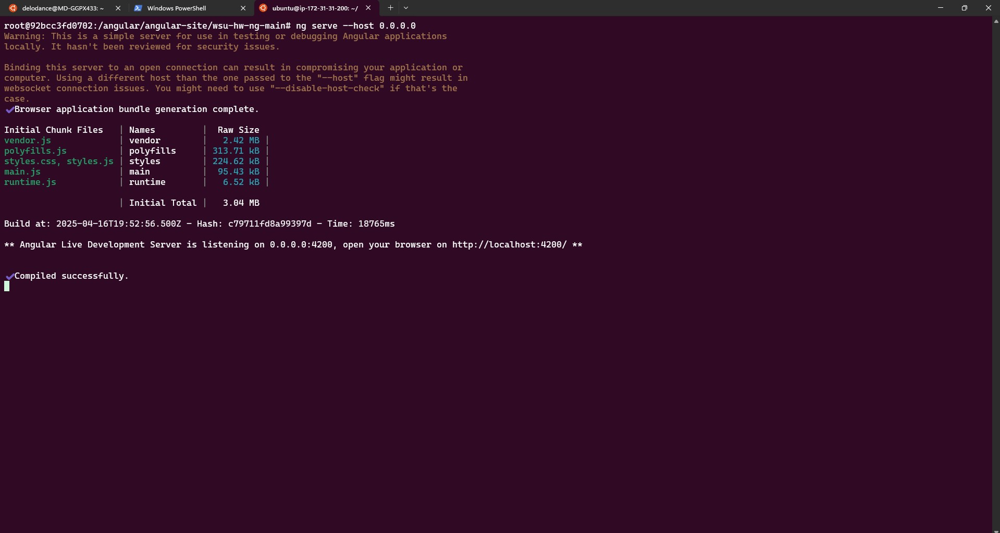


## Dockerfile & Building Images
  - Dockerfiles are files that create containers from a specific set of instructions. In constrast to how we manually built 
  the angular file in the last step the dockerfile in sense does it for you but requires different steps. My Dockerfile has a

1. FROM node:18-bullseye - that uses node:18-bullseye as the base container we're using.

2. WORKDIR /usr/src/app - this creates the directory in where the container will be at

3. COPY wsu-hw-ng-main/ . - this is going to copy over the unzipped file which is where the angular site is over to that directory.

4. RUN npm install -g @angular/cli - this is going to install angular.

5. RUN npm install - this is going to make sure npm is installed.

6. EXPOSE 4200 - this allows the port 4200 which angular runs on to be open even though is optional

7. CMD ["ng", "serve", "--host", "0.0.0.0"] - this is saying that this command ng serve --host 0.0.0.0 when ran will run the angular.

  - Building the image from the dockerfile repository is to make sure the dockerfile an the angular unzipped file are in the same directory without 
  this step this will not work. Once that is vaildated the next step is to run the command sudo docker build -t firstimage . , the . at the end make
  sure it's in the same directory as the docker file and the firstimage can be any name but that is going to be the name of the image built by the docker instructions.

  - 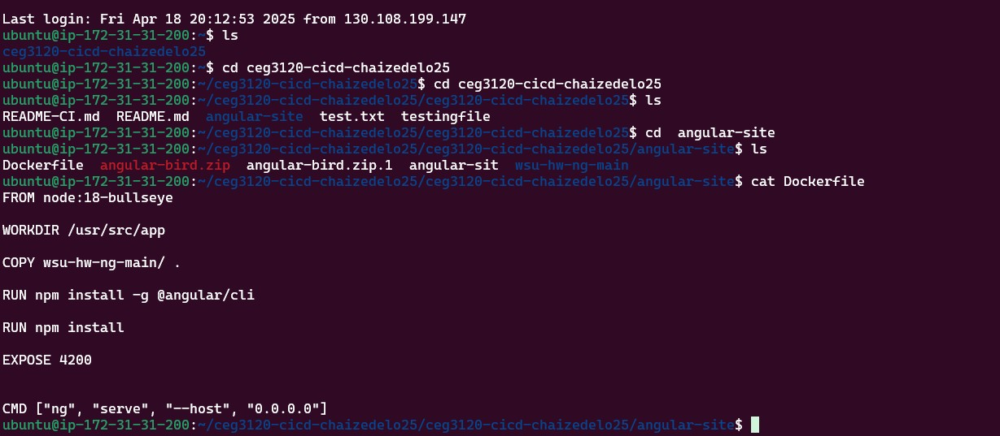

   - My dockerfile is located in the subdirectory in my angular-site. 

  - To run the image from the container that will serve the angular application from the dockerfile will be to use a port bind. This is important because this port bind 
  will allow the angular application to ran from the localhost side. That command will be ```sudo docker run -it - p 4400:4200 firstimage``` , the 4400:4200 is 
  establishes what port angular will be ran on as stated before angular runs on port 4200 so that's the listening port 4400 is the port created to run.
  The commands -it let's the user interact with the container and -p helps establish the port set up.

  - To vaildate that the dockerfile is running the image on the container side run the command ```sudo docker run -p 4400:4200```

  - To vaildate that the dockerfile is running the image on the host side we run ```http://localhost:4400.```, this localhost will be 
  the ip address used to connect to the aws instance in our case. 

  - 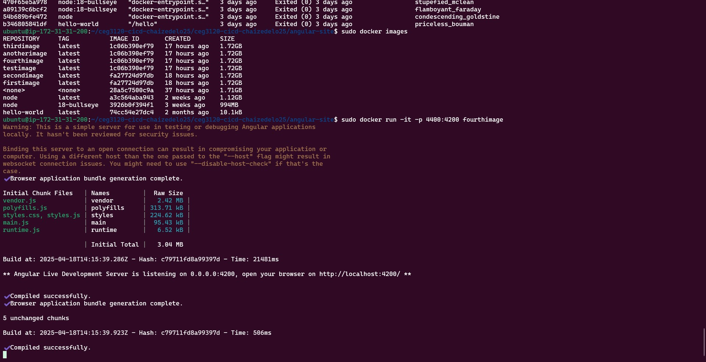
  - 

  - 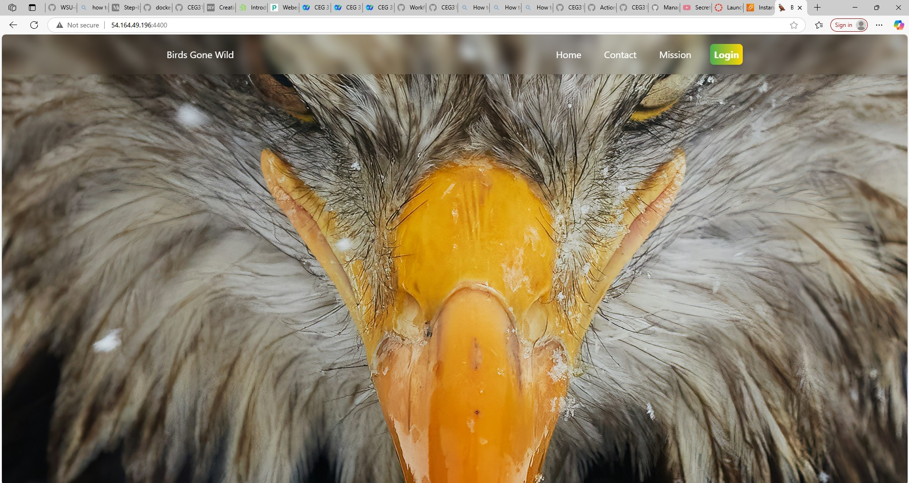


## Working with your DockerHub Repository
  - To create a dockerhub repo go to dockerhub.com and once on that website create an account. Once the account is created got the myhub
   section and and click on repositories and then select create a repository. Once there create a name, make a short description, 
  and make sure the public option is chosen. Then select create.

  - To create a PAT (Personal Access Token) in dockerhub go to account settings and then select personal access tokens. Once there select generate new 
  token and the scope for this PAT will be Read and Write because we want to be able to push and add images to this repository. We'll make the expiration 
  date never on this so it won't run out.

  - To authenticate with DockerHub run the command sudo docker login once entering that in the command line terminal docker will ask for a username and password.
   This username will be the username created when making the docker account, the password will be the PAT token. Once there's a successful login, 
   they'll be a notification saying so.

  - 

  - To push a container image to the dockerhub repository, the first thing to do is to make sure to run the command ```sudo docker build -t wsudeloach/deloach-ceg3120 .```
   (this is the public repos title). This is important because it'll build that image for our public repo, this command also needs to be run in 
  the same directory of where the angular app is. Once that command is run as well as the login is a success now it's time to push with the command
  sudo docker push wsudeloach/deloach-ceg3120 this will push the images to the dockerfile repo.

  -  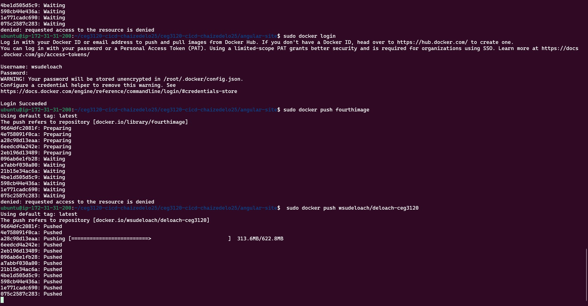

  - Link to dockerhub repo: https://hub.docker.com/repository/docker/wsudeloach/deloach-ceg3120/general  


## Part 2 - Github Actions and DockerHub

  - To create a PAT in github, the first thing to do is go to settings and then go to developer settings. In the left sidebar, under
   Personal access tokens, click classic tokens he reason for classic tokens instead of fine-grained is  because while fine-grained are more secure than classic tokens,
   classic tokens allow for more access to public repos. Next click Generate new token, under Token name, enter a name for the 
   token in this case mines is name Project-4Token.The expiration date can be never but in terms of security probably not the best
   option. The scope I've given the key is to be able to have access to the repo, the workflow, and the codespace. 


   - Workflows in github are a way of automating a process that helps the user not have to build it manually. In this project we 
  used a github workflow to push the images created from the dockerfile to dockehub. When using the workflow it's important to make the github
  action variables for the docker login. Once these are in the serect variables we  can use it now in the github workflow. 

  - 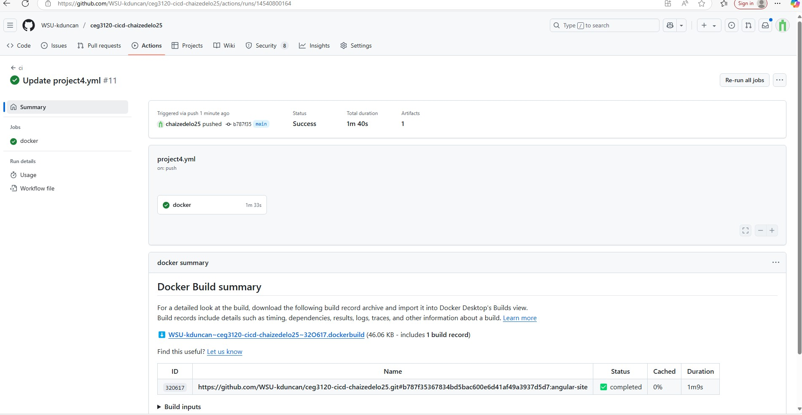

  - These action variables are also known as sercets and they're hidden which is useful as this will be our login credintials
    for dockerhub.

  - 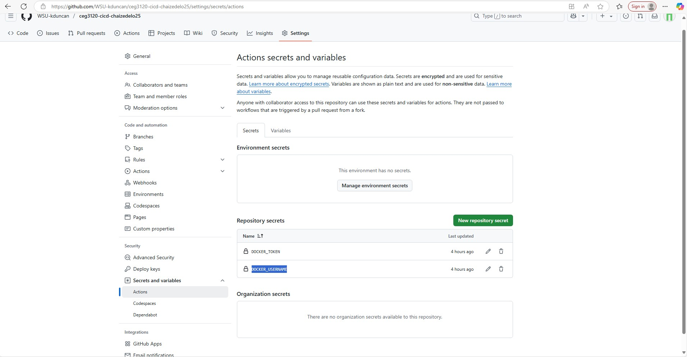

  - It's important to note that when your dockerfile is in a subdirectory it's important to subdir command within the workflow commands. 

  - Link to workflow: https://github.com/WSU-kduncan/ceg3120-cicd-chaizedelo25/blob/main/.github/workflows/project4.yml 


## Part 3 - Project Description and Diagram 

  - The goal of this project is to build a container image that runs on an angular app. We had to do this manually,
  with a dockerfile, and with github actions. 

  - The tools used in this project are angular, dockerhub, dockerfiles, and the
  aws instances.


  - Things that aren't working so far in the project is making sure that in the future
  to put the Dockerfile in the github's repo out of a subdirectory. This would make the process
  of the workflow easier. 
  

  - Diagram:
    - 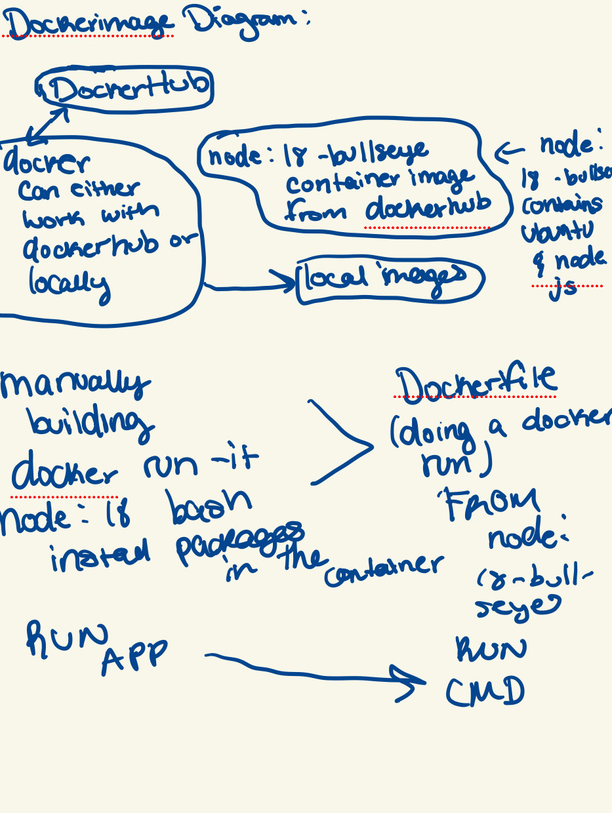
    - 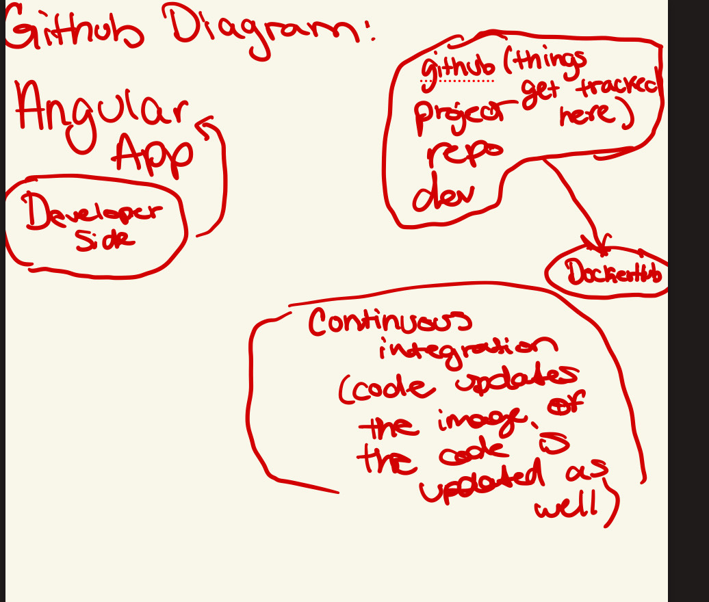

## Citations: 
https://github.com/marketplace/actions/build-and-push-docker-images
https://youtu.be/R8_veQiYBjI?si=c3BUHen85B-H3CkS
https://gitlab.com/nanuchi/youtube-tutorial-series/-/blob/master/github-actions/links.md
https://docs.github.com/en/actions/writing-workflows/choosing-when-your-workflow-runs/events-that-trigger-workflows#push
https://docs.docker.com/build/ci/github-actions/ 
https://dev.to/rodrigokamada/creating-and-running-an-angular-application-in-a-docker-container-40mk
https://github.com/nodejs/docker-node/blob/ba2b3e61e6aaf4643108fb5f1cda9ee5238efde5/18/bullseye/Dockerfile
https://docs.docker.com/build/ci/github-actions/
https://docs.docker.com/build/ci/github-actions/secrets/
https://medium.com/@srijaanaparthy/step-by-step-guide-to-install-docker-on-ubuntu-in-aws-a39746e5a63d


## Chatgpt Ciations:
- 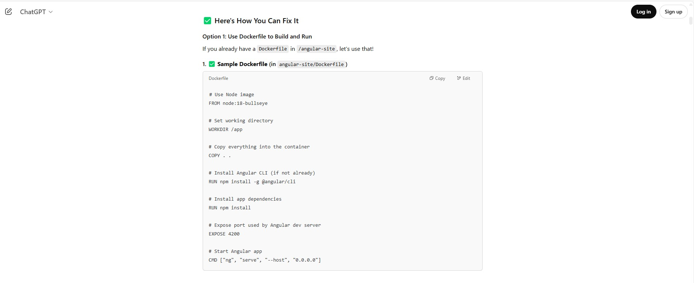
- 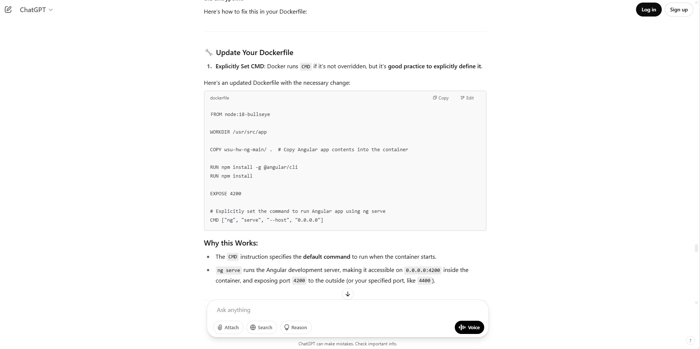
- 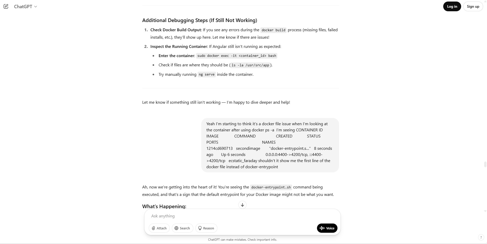
- 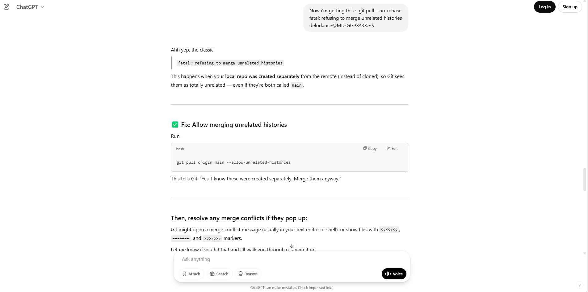
  - This chatgpt prompt was used for help with my connection to github pushing and pulling that was
    the need for the help with the resbase pull help. 

